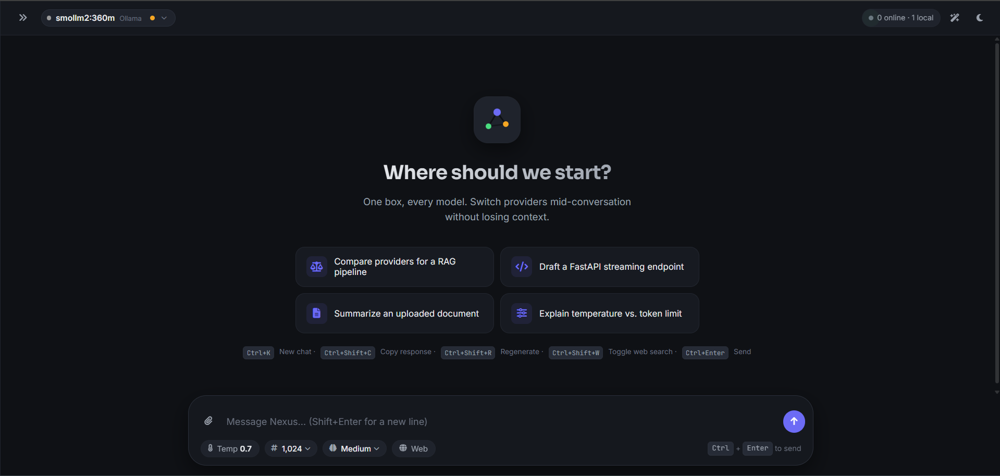

<div align="center">

# Nexus

### Universal AI Chat Platform

**One interface. Every model. Your workflow.**

A privacy-first AI workspace for chatting with cloud and local LLMs from a single modern interface.

[](https://www.python.org/)
[](https://fastapi.tiangolo.com/)
[](LICENSE)
[]()
[]()

</div>

---

## ✨ Meet Nexus

Nexus is an open-source, privacy-first AI chat platform that brings multiple Large Language Models into one unified workspace.

Connect cloud providers such as **OpenAI, Anthropic, Gemini, NVIDIA NIM, Groq, Mistral, DeepSeek, OpenRouter** and more — or run models locally through **Ollama**.

Switch models, upload documents, use RAG, search the web, manage provider keys, and keep your conversations in one place.

> **Nexus v1.1 is under active development.** Features and APIs may evolve as the project grows.

---

## 🖥️ Interface

<p align="center">
  
</p>

<p align="center">
  <sub>One box, every model — switch providers without leaving your workspace.</sub>
</p>

---

## 🚀 Key Features

### 🤖 Multi-Provider AI

Connect multiple cloud and local AI providers from one interface and switch between models without changing applications.

### ⚡ Streaming Chat

Responses are streamed token-by-token for a fast and responsive conversational experience.

### 🦙 Local AI with Ollama

Use locally installed Ollama models directly inside Nexus while keeping inference on your machine.

### 📚 Document Chat + RAG

Upload documents and ask questions about their contents.

Nexus chunks documents, generates embeddings, retrieves relevant sections, and sends only the most useful context to the model.

### 🌐 Web Search

Augment conversations with live web results using the built-in search integration.

### 🧩 Skills

Reusable AI workflows for tasks such as debugging, API design, coding review, and web-assisted research.

### 💬 Persistent Conversations

Conversation history is stored locally and organized in a date-based sidebar.

### 🎨 Customizable Interface

Choose between light, dark, or system themes with multiple accent colors.

### 🔐 Privacy Focused

Local authentication, encrypted provider keys, secure password hashing, and local conversation storage.

---

## 🤖 Supported AI Providers

| Provider | Type | API Key |
|---|:---:|:---:|
| Anthropic | ☁️ Cloud | Required |
| OpenAI | ☁️ Cloud | Required |
| NVIDIA NIM | ☁️ Cloud | Required |
| Together AI | ☁️ Cloud | Required |
| Groq | ☁️ Cloud | Required |
| OpenRouter | ☁️ Cloud | Required |
| DeepSeek | ☁️ Cloud | Required |
| Mistral AI | ☁️ Cloud | Required |
| Google Gemini | ☁️ Cloud | Required |
| Ollama | 🖥️ Local | Not required |
| OmniRoute | 🖥️ Local | Required |

The provider registry is extensible, making it possible to add additional providers as Nexus evolves.

---

## ⚡ Quick Start

### Requirements

Before starting, make sure you have:

- Python **3.11**, **3.12**, or **3.13** (64-bit)
  - Python **3.14 is not yet supported** — dependencies are still being updated
- Git
- Ollama *(optional — only required for local models)*

### 1. Clone UniversalAI

```bash
git clone https://github.com/keshria-hacker/Universal-Ai-Chat-Platform.git
cd Universal-Ai-Chat-Platform
```

### 2. Configure Environment

Copy the example environment file:

```bash
cp .env.example .env
```

Add the API keys for the providers you want to use.

```env
OPENAI_API_KEY=your_key
ANTHROPIC_API_KEY=your_key
NVIDIA_NIM_API_KEY=your_key
GOOGLE_API_KEY=your_key
OPENROUTER_API_KEY=your_key
GROQ_API_KEY=your_key
```

You don't need to configure every provider.

API keys can also be managed later from:

**Settings → Provider API Keys**

### 3. Start UniversalAI

All platforms — one command:

**Windows (cmd/PowerShell):**
```bash
python start.py
```
Or double-click `run.bat`.

**Linux / macOS:**
```bash
python start.py
```
Or run `./start.sh`.

The launcher will automatically:
1. Detect your OS and Python version
2. Verify Python 3.11–3.13 (64-bit)
3. Create an isolated virtual environment
4. Install locked dependencies
5. Validate that critical packages import correctly
6. Generate a secure MASTER_KEY if needed
7. Start the backend server
8. Run a backend health check
9. Start the frontend server
10. Open the application in your browser

### 4. Open UniversalAI

Once the servers are running:

| Service | Address |
|---|---|
| UniversalAI | `http://127.0.0.1:5500` |
| Backend API | `http://127.0.0.1:8001` |
| Swagger API Docs | `http://127.0.0.1:8001/docs` |

---

## 🐳 Docker

Nexus can also run using Docker.

### Build

```bash
docker build -f Dockerfile.all -t nexus-all .
```

### Configure

```bash
cp .env.example .env
```

Add your required API keys to `.env`.

### Run

```bash
docker run -d \
  -p 8001:8001 \
  -p 5500:5500 \
  --env-file .env \
  nexus-all
```

### Docker Compose

```bash
docker compose -f docker-compose.all.yml up -d
```

---

## 🦙 Using Ollama

Nexus automatically detects available Ollama models.

Install or pull a model:

```bash
ollama pull llama3.2
```

Start Ollama:

```bash
ollama serve
```

Downloaded models will automatically appear inside the Nexus model selector.

To use another Ollama server:

```env
OLLAMA_BASE_URL=http://your-ollama-host:11434
```

> Ollama currently needs to be started manually.

---

## 📂 Document Support

Nexus can extract and work with multiple document and source-code formats.

| Format | Support |
|---|:---:|
| PDF | ✅ |
| DOCX | ✅ |
| XLSX | ✅ |
| PPTX | ✅ |
| CSV | ✅ |
| TXT / Markdown | ✅ |
| JSON | ✅ |
| HTML / XML | ✅ |
| Source Code | ✅ |

### RAG Pipeline

Large documents are automatically:

**Extracted → Chunked → Embedded → Retrieved → Added to Context**

Only the most relevant document sections are sent to the selected model, helping reduce unnecessary context usage.

---

## 🌐 Web Search

Enable **Web Search** directly from the Nexus composer to provide the model with current web information.

Supported search backends include:

- **DuckDuckGo Lite** — default, no API key required
- **Tavily** — optional
- **Brave Search** — optional

---

## 🧩 Skills

Nexus includes an extensible Skills system for reusable AI workflows.

Current built-in skills include:

| Skill | Purpose |
|---|---|
| API Design Assistant | Design REST / GraphQL APIs |
| Coding Standards Review | Review code quality and standards |
| Debugging Assistant | Structured debugging workflows |
| Web Search Assistant | Enhance responses with live search |

Custom skills can be created using `SKILL.md` files.

---

## 🛠️ Tech Stack

| Layer | Technology |
|---|---|
| Backend | Python + FastAPI |
| Frontend | Vanilla JavaScript SPA |
| Database | SQLite + SQLAlchemy |
| LLM Integration | LiteLLM |
| RAG / Vector Search | ChromaDB |
| Authentication | Local Auth |
| API | REST + SSE Streaming |
| Deployment | Docker / Docker Compose |

---

## 🔐 Security & Privacy

Nexus is currently designed as a **local, single-user application**.

Security features include:

- 🔒 Provider API keys encrypted at rest
- 🔑 scrypt password hashing
- 🍪 HTTP-only authentication cookies
- 🛡️ CSRF protection
- 🚫 Debug mode disabled by default
- 💾 Local conversation storage

> **Important:** Nexus is not currently intended to be exposed directly to the public internet without additional production security configuration.

See [`SECURITY.md`](SECURITY.md) for security and vulnerability reporting information.

---

## 🧪 Testing

Run the test suite from the project root:

**Windows:**
```bash
venv\Scripts\python.exe -m pytest tests -v --ignore=tests/manual
```

**Linux / macOS:**
```bash
venv/bin/python -m pytest tests -v --ignore=tests/manual
```

Tests cover core functionality including authentication, document processing, model discovery, streaming, Skills, and web search.

Tests run automatically on every pull request via GitHub Actions across Windows, Linux, and macOS with Python 3.11, 3.12, and 3.13.

---

## 🔧 Troubleshooting

### Unsupported Python version

```text
UniversalAI Environment Check
  Python 3.14.x is not supported.
```

**Fix:** Install Python 3.11, 3.12, or 3.13 (64-bit) from [python.org](https://www.python.org/downloads/).

---

### Windows Application Control (AppLocker / WDAC)

```text
ERROR: Windows Application Control blocked a required Python package.
```

UniversalAI will not bypass your system security policy. If this is your personal computer:

1. Check **Windows Event Viewer** → Applications and Services Logs → Microsoft → Windows → AppLocker
2. Try cloning the project to a different folder (e.g., `C:\Users\YourName\`)
3. Use Docker as an alternative: `docker compose -f docker-compose.all.yml up -d`

---

### Dependency installation fails

```text
ERROR: Dependency installation failed.
```

**Common causes:**
- Network issues — retry with a stable connection
- Missing build tools for native packages (e.g., `chromadb` on Linux requires `build-essential`)

**Fix:**
- **Linux:** `sudo apt install build-essential python3-dev`
- **macOS:** `xcode-select --install`
- **Windows:** Install [Microsoft C++ Build Tools](https://visualstudio.microsoft.com/visual-cpp-build-tools/)

Then delete `venv/` and run `python start.py` again.

---

### Port already in use

```text
ERROR: Backend failed to start.
```

The launcher attempts to free ports 8001 and 5500 automatically. If that fails:

1. Check what is using the port:
   - **Windows:** `netstat -ano | findstr :8001`
   - **Linux/macOS:** `lsof -i :8001`
2. Stop the conflicting process or change the port in `start.py`

---

### How to manually recreate the venv

```bash
# Delete the existing virtual environment
rm -rf venv          # Linux/macOS
rmdir /s venv        # Windows (requires confirmation)

# Run start.py again — it will recreate everything
python start.py
```

---

## 🗺️ Roadmap

Nexus is actively evolving toward a more complete universal AI workspace.

- [x] Multi-provider AI chat
- [x] Local Ollama support
- [x] Streaming responses
- [x] Document processing
- [x] RAG / Vector Search
- [x] Web Search
- [x] Skills system
- [x] Docker support
- [ ] Automatic Ollama startup
- [ ] Function Calling / Tools
- [ ] Vision & image understanding
- [ ] MCP integration
- [ ] Multi-user workspaces
- [ ] Desktop application
- [ ] Plugin marketplace

---

## 🤝 Contributing

Contributions, bug reports, feature requests, and improvements are welcome.

### Development Setup

```bash
git clone https://github.com/keshria-hacker/Universal-Ai-Chat-Platform-.git
cd Universal-Ai-Chat-Platform--
cp .env.example .env
python start.py
```

When contributing, please keep changes focused and follow the existing project structure and coding conventions.

---

## 📄 License

Nexus is released under the **MIT License**.

See [`LICENSE`](LICENSE) for details.

---

<div align="center">

### Nexus

**One interface. Every model. Your workflow.**

Built with ❤️ for the open-source AI community.

⭐ **If you find Nexus useful, consider giving the project a star.**

</div>
